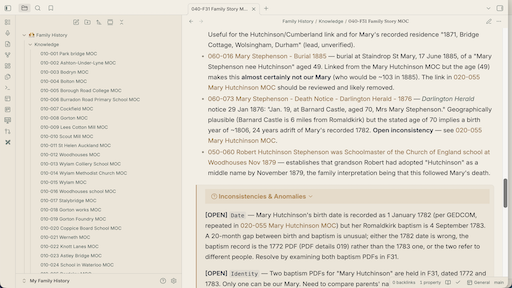
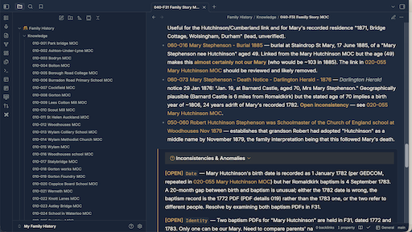

This theme was created by Claude Code using Opus 4.8 based on my [personal brand](https://github.com/martinlockett/personal_brand) which reprersents my values and personality.

It makes use of fonts Fraunces and Inter - if you do not have them installed you will not have the intended design.

Light: 

Dark: 

The brand guide includes:

#### Colour palette
A restrained five-colour system: deep and thoughtful, with a single warm spark for the generative, communicative side.

Name	|Hex	|Role
--- | --- | ---
Ink Navy	|#1C2B40	|Primary. Depth, intellect, calm under pressure. Text & dark surfaces.
Brass	|#B8843E	|Accent. The spark — ideation, warmth, communication. Use sparingly.
Slate Teal	|#4A6360	|Secondary. Groundedness, balance. Supporting elements.
Parchment	|#F3EEE4	|Light background. Authentic, classical, paper-like.
Graphite	|#23282E	|Body text on light. Softer than pure black — honest, not harsh.

Usage ratio Roughly 60% Parchment / 25% Ink Navy / 10% Slate Teal / 5% Brass. Brass is a seasoning, never a base. If a layout feels loud, you've used too much Brass.

Accessibility: Ink Navy and Graphite both pass AA contrast on Parchment. Brass on Parchment is decorative only — never set body text in Brass.
